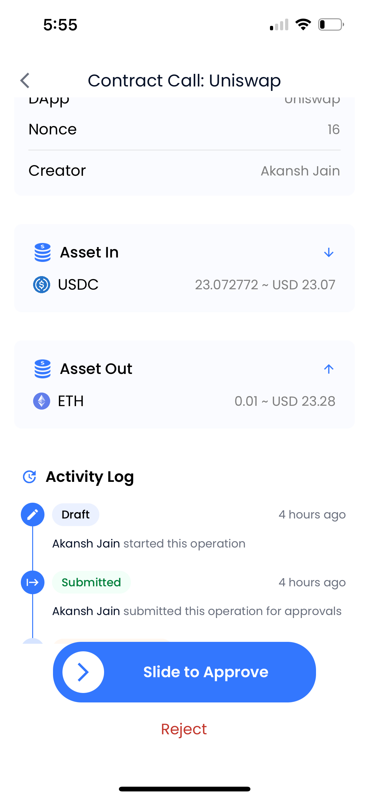

# Accessing DeFi

**DeFi Access Introduction**

DApp access in PrimeVault is supported via PrimeVault’s Chrome Browser Extension which can be installed in the Chrome Web Store.

**How to access DeFi protocols**&#x20;

* Download PrimeVault extension
* Log into your extension
* Whitelist a DApp
* Conduct a DApp transaction
* View a DApp transaction
* Approve a DApp transaction

### Download PrimeVault extension

1. Download PrimeVault in Google Chrome Web Store: [https://chrome.google.com/webstore/detail/primevault/fgmfmeoikkgpemaocbmjlkhcpcjfobkf](https://chrome.google.com/webstore/detail/primevault/fgmfmeoikkgpemaocbmjlkhcpcjfobkf)
2. **Please restart chrome** once you've downloaded the app
3. Authenticate the extension before connecting to a DApp
4. Disable your Metamask to enable the best experience (since we use similar channels and some DApps are unable to distinguish between Metamask and PrimeVault)
5. Use the native PrimeVault extension (recommended) or WalletConnect to connect with the DApp
6. Whitelist DApp before interacting with the DApp

<figure><figcaption>
Click on login to authenticate
</figcaption></figure>

<figure><figcaption></figcaption></figure>

<figure><figcaption></figcaption></figure>

### Login to a vault in your extension

1. Select the desired Vault from which you would like to use for interacting with the DApp and click 'Continue'

<figure><figcaption></figcaption></figure>

2. Review assets and press 'Connect'
3. You can change vaults using the toggle option once connected&#x20;

<figure><figcaption></figcaption></figure>

### Whitelist a DApp

Your workspace Admins can whitelist dApps on supported chains in their PrimeVault web app.

1. Log into your PrimeVault app in a browser (Chrome recommended). Go to DApps > Directory tab and click on the 'Whitelist New DApp' button. Some trusted DApps have already been whitelisted by PrimeVault and you can begin using them instantly&#x20;
2. Add Name, URL, and category for the DApp you would like to whitelist. Your request will be sent across the organization for approvals based on your policies
3. You can manually add contracts using '+ Add New Contract' within DApps where you would like to skip risk scoring from PrimeVault&#x20;
4. Your organization approvers will receive a mobile notification to approve the DApp before you can begin using it. Once approved by your admins, you can begin using the DApp

<figure><figcaption></figcaption></figure>

### Conduct a DApp transaction

1. Once you've connected to the whitelisted DApp, proceed with entering the details of your transaction (swap, stake, borrow etc.)
2. Approve the transaction on your mobile device

<figure><figcaption></figcaption></figure>

### View a DApp transaction

1. You can view a DApp transaction under the section 'Contract Call' in the Transactions section on your desktop browser or under the 'Pending Transactions' tab in your extension (if its not been received full approval yet)

<figure><figcaption></figcaption></figure>

### Approve a DApp transaction

1. As per your organization's policies, you will be able to view who has requested for the DApp transaction; transaction details and approvals remaining for a successful transaction

2. Slide right or press Reject - to approve or reject the DApp transaction
3. The process will require FaceID for approval go through
4. Once approved, you can begin view transaction details from your dashboard
