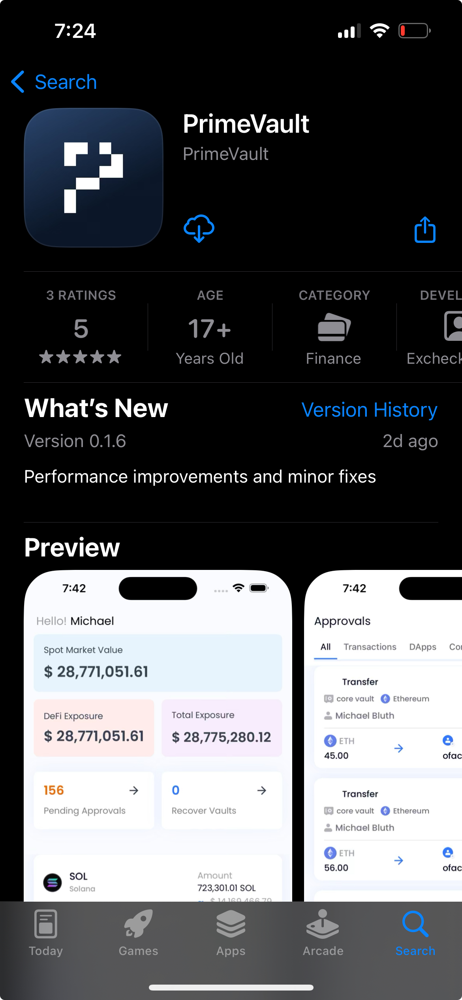
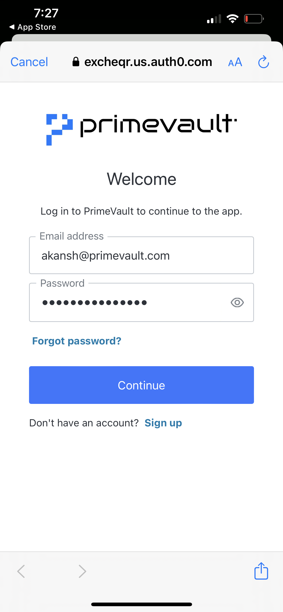

# Setting up your mobile app

## iOS users

### Download the app

1. Download the app via the Apple App Store (we are live in 174 out of 175 countries {China excluded} where the Apple App Store is present - [https://support.apple.com/en-us/HT204411](https://support.apple.com/en-us/HT204411))&#x20;
2. Search for 'PrimeVault' in the App Store&#x20;

<figure><figcaption></figcaption></figure>

### Log into mobile app

1. Enter your company email address and password
2. Allow notifications on the app to receive updates (approval notifications, transaction updates etc.)
3. Allow access to FaceID&#x20;
4. Click on 'remember device for 30 days' if you want to entering 2FA everytime
5. Enter your 2FA using your authenticator app&#x20;

<figure><figcaption></figcaption></figure>
